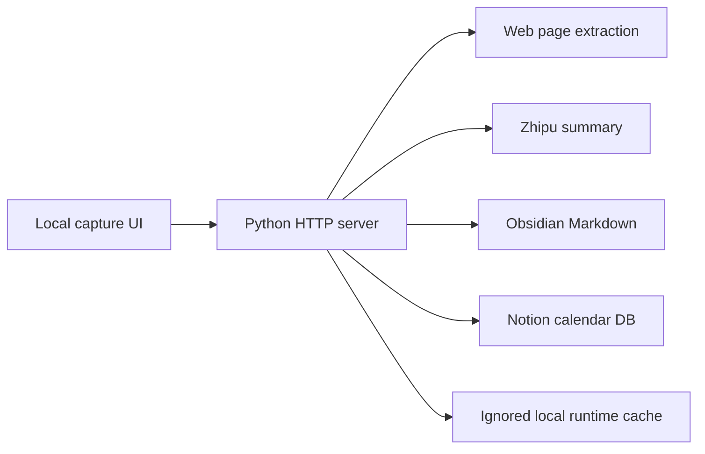

<p align="center">
  
</p>

<h1 align="center">Vault Capture</h1>

<p align="center">
  <strong>Local-first URL capture for Obsidian vaults and Notion calendar databases.</strong>
</p>

<p align="center">
  <a href="LICENSE"></a>
  
  
  
  
</p>

<p align="center">
  
</p>

## Overview

Vault Capture is a focused local workflow for turning useful web pages into durable personal knowledge. It extracts a source URL, generates a Chinese summary, previews the result, then writes the confirmed capture to an Obsidian vault and a Notion calendar database.

The project is intentionally small: a local HTML interface, a Python server, PowerShell launch scripts, and plain configuration files. Secrets and runtime data stay local.

## Why It Exists

Most capture tools either stop at bookmarks or scatter content across separate systems. Vault Capture gives one repeatable path:

- Capture once from a URL.
- Review the extracted title, category, summary, tags, and duplicate status.
- Save a raw archive and a cleaned Obsidian note.
- Sync a structured Notion entry that is easy to browse by date, category, platform, and source.

## Highlights

- Review-before-write flow to avoid polluting Obsidian or Notion with bad extraction results.
- Duplicate-aware capture so repeated URLs update existing records where possible.
- Obsidian-first Markdown output for long-term portability.
- Notion calendar database for browsing and resurfacing captured knowledge.
- Local-only credentials through `config.ps1`, which is ignored by Git.
- Minimal dependency surface: Python, PowerShell, `requests`, and `beautifulsoup4`.

## Architecture



For a deeper system breakdown, see [docs/architecture.md](docs/architecture.md).

## Requirements

- Windows with PowerShell
- Python 3.10 or newer
- An Obsidian vault
- A Zhipu API key
- A Notion integration token
- A Notion parent page where the capture database can be created or reused

## Quick Start

```powershell
python -m venv .venv
.\.venv\Scripts\Activate.ps1
pip install -r requirements.txt

Copy-Item .\config.example.ps1 .\config.ps1
notepad .\config.ps1

.\launch-url-capture.bat
```

Open the local app:

```text
http://127.0.0.1:8765
```

## Configuration

`config.ps1` contains local paths and credentials, so it is intentionally excluded from Git. Start from `config.example.ps1`.

| Variable | Purpose |
| --- | --- |
| `ZHIPU_API_KEY` | Zhipu API key used for Chinese summaries |
| `ZHIPU_MODEL` | Model name, default `glm-5.1` |
| `OBSIDIAN_VAULT_PATH` | Local Obsidian vault path |
| `URL_CAPTURE_PORT` | Local server port, default `8765` |
| `NOTION_API_TOKEN` | Notion integration token |
| `NOTION_PARENT_PAGE_ID` | Parent Notion page id used to create or find the capture database |

## Output

Vault Capture writes to:

- `<Obsidian Vault>/Clippings/Archive`
- `<Obsidian Vault>/信息汇总/自动整理/<category>/`
- A Notion database named `网页采集日历`

The Notion database includes title, capture date, publish date, category, platform, site, source URL, tags, summary, and Obsidian path.

## Project Layout

| Path | Purpose |
| --- | --- |
| `url-capture.html` | Local capture interface |
| `url_capture_server.py` | Local HTTP API, extraction, summary, Obsidian write, Notion sync |
| `launch-url-capture.bat` | Windows launcher |
| `start-url-capture.ps1` | Loads `config.ps1` and starts the server |
| `config.example.ps1` | Safe configuration template |
| `summary-schema.json` | Summary output shape |
| `assets/` | README visual assets |
| `docs/` | Architecture and operating notes |

Older n8n exports and manual test payloads are treated as local artifacts until they are sanitized for sharing.

## Health Check

With the server running:

```powershell
Invoke-RestMethod http://127.0.0.1:8765/api/health
```

## Security

This is a local personal workflow tool, not a hosted multi-user service. Keep it bound to `127.0.0.1` unless you have reviewed and hardened every write endpoint.

Never commit:

- `config.ps1`
- `runtime/`
- API keys or Notion tokens
- local vault paths that reveal private machine structure
- captured page history or personal note content

See [SECURITY.md](SECURITY.md) for the full policy.

## License

MIT. See [LICENSE](LICENSE).
