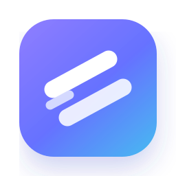
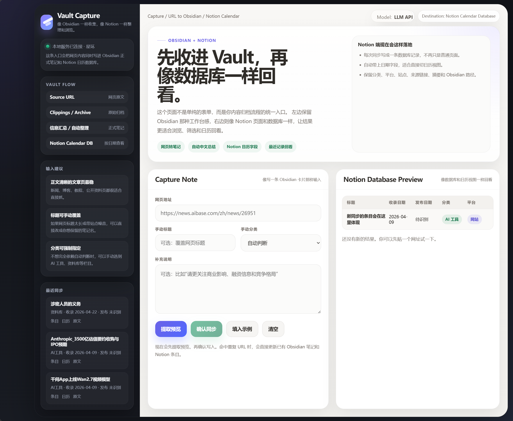
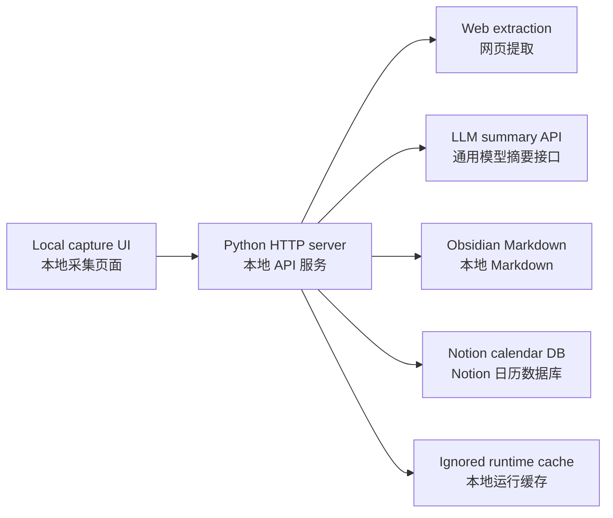

<p align="center">
  
</p>

<h1 align="center">Vault Capture</h1>

<p align="center">
  <strong>本地优先的网页采集工作流：URL -> Obsidian Vault -> Notion Calendar Database</strong><br>
  <strong>Local-first URL capture for Obsidian vaults and Notion calendar databases.</strong>
</p>

<p align="center">
  <a href="LICENSE"></a>
  
  
  
  
</p>

<p align="center">
  
</p>

## 中文简介

Vault Capture 是一个本地优先的个人知识采集工具。它把网页 URL 提取、中文摘要、人工预览、Obsidian Markdown 归档和 Notion 日历数据库同步串成一个稳定流程。

它不绑定某一家模型服务。摘要层使用通用的 OpenAI-compatible Chat Completions 协议，可以接 OpenAI、DeepSeek、Moonshot、OpenRouter、硅基流动、智谱，或任何兼容 `/chat/completions` 的供应商。

## English Overview

Vault Capture is a local-first personal knowledge capture workflow. It extracts a source URL, generates a structured Chinese summary, lets you review the result, then writes the confirmed capture to Obsidian Markdown and a Notion calendar database.

The summarization layer is provider-agnostic. It speaks the OpenAI-compatible Chat Completions shape, so it can work with OpenAI, DeepSeek, Moonshot, OpenRouter, SiliconFlow, Zhipu, or any compatible `/chat/completions` provider.

## Why It Exists / 为什么做这个

- Capture once from a URL, then reuse the result across Obsidian and Notion.
- 先预览、再写入，避免把错误摘要或脏数据写进知识库。
- Keep Markdown as the durable source of knowledge.
- 让 Notion 负责日历视图、分类筛选和回看。
- Keep credentials, runtime cache, and personal capture history local.
- 不把 API key、本地路径和采集历史提交到 Git。

## Highlights / 核心能力

- Review-before-write capture flow.
- Duplicate-aware URL capture and update behavior.
- Provider-neutral LLM summary API.
- Obsidian-first Markdown output.
- Notion calendar database sync.
- Local-only `config.ps1` for API keys and vault paths.
- Minimal dependency surface: Python, PowerShell, `requests`, and `beautifulsoup4`.

## Architecture / 架构



For a deeper system breakdown, see [docs/architecture.md](docs/architecture.md).

## Requirements / 环境要求

- Windows with PowerShell
- Python 3.10 or newer
- An Obsidian vault
- A Notion integration token
- A Notion parent page where the capture database can be created or reused
- Any OpenAI-compatible LLM API key

## Quick Start / 快速开始

```powershell
python -m venv .venv
.\.venv\Scripts\Activate.ps1
pip install -r requirements.txt

Copy-Item .\config.example.ps1 .\config.ps1
notepad .\config.ps1

.\launch-url-capture.bat
```

Open the local app:

```text
http://127.0.0.1:8765
```

## LLM Configuration / 模型接口配置

`config.ps1` contains local paths and credentials, so it is intentionally excluded from Git. Start from `config.example.ps1`.

`LLM_API_BASE_URL` should point to the provider's OpenAI-compatible API base. Vault Capture appends `/chat/completions` automatically. If your provider uses a full custom endpoint, set `LLM_API_URL` instead.

| Variable | 中文说明 | English |
| --- | --- | --- |
| `LLM_PROVIDER` | 供应商标记，仅用于识别 | Provider label for display/debugging |
| `LLM_API_BASE_URL` | API base URL，自动追加 `/chat/completions` | API base URL, `/chat/completions` is appended |
| `LLM_API_URL` | 完整 chat completions endpoint，可覆盖 base URL | Full endpoint override |
| `LLM_API_KEY` | 模型服务 API key | LLM provider API key |
| `LLM_MODEL` | 模型名称 | Model name |
| `LLM_AUTH_HEADER` | 认证头名称，默认 `Authorization` | Auth header name, default `Authorization` |
| `LLM_AUTH_SCHEME` | 认证前缀，默认 `Bearer`，原样 key 可设 `none` | Auth scheme, default `Bearer`; use `none` for raw keys |
| `LLM_RESPONSE_FORMAT` | 默认 `json_object`，不兼容时可设为 `none` | Default `json_object`; set `none` if unsupported |
| `LLM_TEMPERATURE` | 摘要稳定性，建议 `0` | Summary determinism, recommended `0` |
| `LLM_EXTRA_HEADERS_JSON` | 额外请求头 JSON，例如 OpenRouter metadata | Extra headers as JSON |
| `LLM_EXTRA_BODY_JSON` | 额外请求体 JSON，用于供应商特定参数 | Extra body fields as JSON |

Example provider presets. Confirm the current endpoint and model name in your provider's official documentation before using them in production.

示例配置如下。正式使用前，请以供应商当前官方文档里的 endpoint 和 model name 为准。

```powershell
# DeepSeek
$env:LLM_PROVIDER = "deepseek"
$env:LLM_API_BASE_URL = "https://api.deepseek.com"
$env:LLM_MODEL = "deepseek-chat"

# Moonshot
$env:LLM_PROVIDER = "moonshot"
$env:LLM_API_BASE_URL = "https://api.moonshot.cn/v1"
$env:LLM_MODEL = "moonshot-v1-8k"

# OpenRouter
$env:LLM_PROVIDER = "openrouter"
$env:LLM_API_BASE_URL = "https://openrouter.ai/api/v1"
$env:LLM_MODEL = "openai/gpt-4o-mini"
$env:LLM_EXTRA_HEADERS_JSON = '{"HTTP-Referer":"https://github.com/dongyongxue-collab/vault-capture","X-Title":"Vault Capture"}'
```

Legacy local configs using `ZHIPU_API_KEY` and `ZHIPU_MODEL` still work, but new configs should prefer `LLM_*`.

## Notion and Obsidian Configuration / Notion 与 Obsidian 配置

| Variable | 中文说明 | English |
| --- | --- | --- |
| `OBSIDIAN_VAULT_PATH` | 本地 Obsidian vault 路径 | Local Obsidian vault path |
| `URL_CAPTURE_PORT` | 本地服务端口，默认 `8765` | Local server port, default `8765` |
| `NOTION_API_TOKEN` | Notion integration token | Notion integration token |
| `NOTION_PARENT_PAGE_ID` | 用来创建或复用采集数据库的父页面 id | Parent page id for the capture database |

## Output / 输出位置

Vault Capture writes to:

- `<Obsidian Vault>/Clippings/Archive`
- `<Obsidian Vault>/信息汇总/自动整理/<category>/`
- A Notion database named `网页采集日历`

The Notion database includes title, capture date, publish date, category, platform, site, source URL, tags, summary, and Obsidian path.

## Project Layout / 项目结构

| Path | Purpose |
| --- | --- |
| `url-capture.html` | Local capture interface |
| `url_capture_server.py` | Local HTTP API, extraction, LLM summary, Obsidian write, Notion sync |
| `launch-url-capture.bat` | Windows launcher |
| `start-url-capture.ps1` | Loads `config.ps1` and starts the server |
| `config.example.ps1` | Safe configuration template |
| `summary-schema.json` | Summary output shape |
| `assets/` | README visual assets |
| `docs/` | Architecture and operating notes |

Older n8n exports and manual test payloads are treated as local artifacts until they are sanitized for sharing.

## Health Check / 健康检查

With the server running:

```powershell
Invoke-RestMethod http://127.0.0.1:8765/api/health
```

## Security / 安全边界

This is a local personal workflow tool, not a hosted multi-user service. Keep it bound to `127.0.0.1` unless you have reviewed and hardened every write endpoint.

这是本地个人工作流，不是面向公网的多用户服务。除非你补齐认证、CSRF 防护、限流和写接口审计，否则不要把它暴露到公网。

Never commit:

- `config.ps1`
- `runtime/`
- API keys or Notion tokens
- local vault paths that reveal private machine structure
- captured page history or personal note content

See [SECURITY.md](SECURITY.md) for the full policy.

## License / 许可证

MIT. See [LICENSE](LICENSE).
