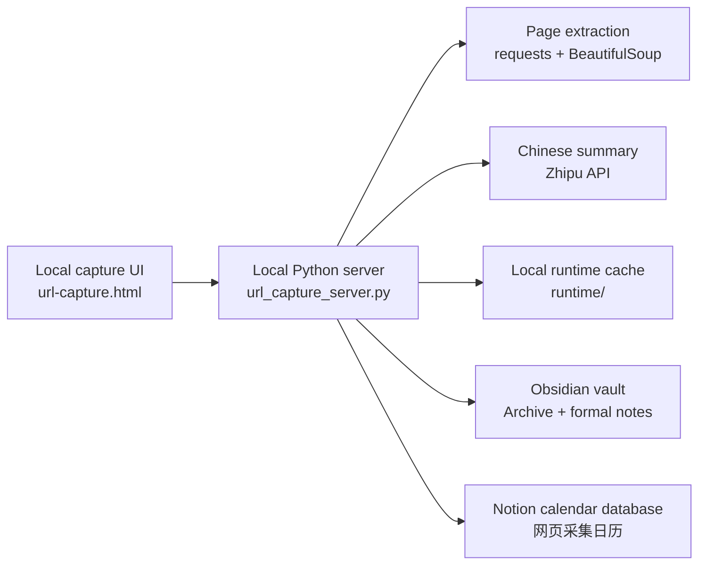

# Architecture

Vault Capture is a local-first capture pipeline. It keeps credentials and working data on the user's machine, then writes only confirmed capture results to Obsidian and Notion.

## Design Principles

- Local-first: configuration, credentials, and capture history stay outside Git and on the user's machine.
- Review-before-write: the UI previews extraction and summary results before committing them to downstream systems.
- Idempotent capture: repeated source URLs update existing records where possible instead of creating duplicate knowledge entries.
- Plain files first: Obsidian output remains portable Markdown instead of an application-specific database.
- Service boundaries: Notion and Zhipu calls are isolated in the local server, keeping the browser UI simple.

## Runtime Surfaces

| Surface | File | Responsibility |
| --- | --- | --- |
| Local UI | `url-capture.html` | Capture form, preview state, Notion-style database preview |
| Launcher | `launch-url-capture.bat` | Starts the workflow from Windows |
| Bootstrap | `start-url-capture.ps1` | Loads local config and starts the Python server |
| Server | `url_capture_server.py` | HTTP API, extraction, summarization, Obsidian write, Notion sync |
| Config template | `config.example.ps1` | Safe example for local secrets and paths |
| Runtime data | `runtime/` | Ignored local cache, history, and Notion metadata |

## Security Boundary

The server is intended to bind to `127.0.0.1`. Do not expose it to a public network without adding authentication, CSRF protection, rate limits, and a review of every write endpoint.
