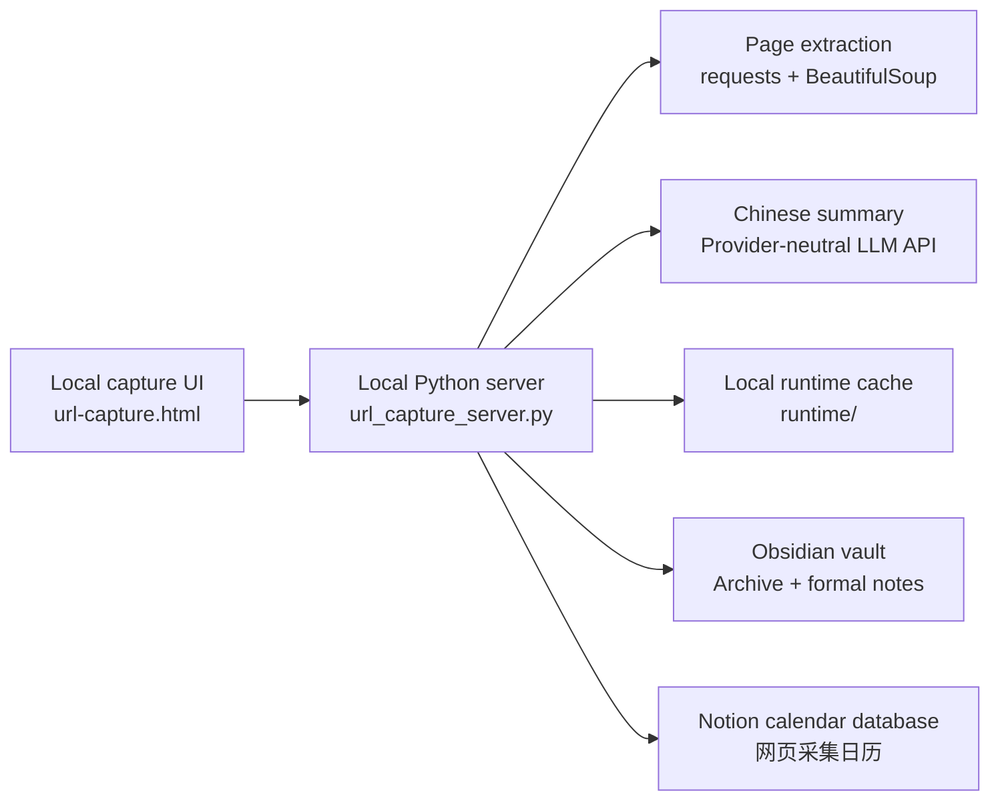

# Architecture

Vault Capture is a local-first capture pipeline. It keeps credentials and working data on the user's machine, then writes only confirmed capture results to Obsidian and Notion.

Vault Capture 是本地优先的网页采集管线。凭据和运行数据保留在用户本机，只有确认后的采集结果会写入 Obsidian 和 Notion。

## Design Principles

- Local-first: configuration, credentials, and capture history stay outside Git and on the user's machine.
- Review-before-write: the UI previews extraction and summary results before committing them to downstream systems.
- Idempotent capture: repeated source URLs update existing records where possible instead of creating duplicate knowledge entries.
- Plain files first: Obsidian output remains portable Markdown instead of an application-specific database.
- Provider-neutral summary: the LLM layer uses an OpenAI-compatible Chat Completions contract instead of a single vendor SDK.
- Service boundaries: Notion and LLM calls are isolated in the local server, keeping the browser UI simple.

## 中文设计原则

- 本地优先：配置、凭据和采集历史不进入 Git，保留在用户本机。
- 写入前预览：先确认提取和摘要结果，再同步到 Obsidian 与 Notion。
- 幂等采集：重复 URL 尽量更新已有记录，减少重复知识条目。
- 纯文本优先：Obsidian 输出保持为可迁移的 Markdown。
- 模型供应商中立：摘要层使用 OpenAI-compatible Chat Completions 形态，不绑定单一厂商 SDK。
- 边界清晰：Notion 和 LLM 调用都集中在本地 server，浏览器 UI 保持简单。

## Runtime Surfaces

| Surface | File | Responsibility |
| --- | --- | --- |
| Local UI | `url-capture.html` | Capture form, preview state, Notion-style database preview |
| Launcher | `launch-url-capture.bat` | Starts the workflow from Windows |
| Bootstrap | `start-url-capture.ps1` | Loads local config and starts the Python server |
| Server | `url_capture_server.py` | HTTP API, extraction, LLM summarization, Obsidian write, Notion sync |
| Config template | `config.example.ps1` | Safe example for local secrets and paths |
| Runtime data | `runtime/` | Ignored local cache, history, and Notion metadata |

## Security Boundary

The server is intended to bind to `127.0.0.1`. Do not expose it to a public network without adding authentication, CSRF protection, rate limits, and a review of every write endpoint.
